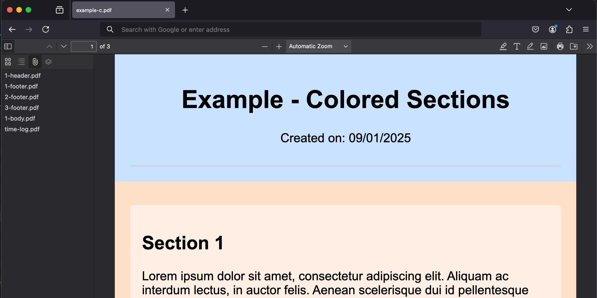

<div align="center">
  <strong>Generate PDF documents from HTML template in node environment.</strong>
</div>
<div align="center">
  Fine-tune your PDFs with customisable page size, headers, footers, backgrounds, and page numbering. All from a simple HTML template.
</div>

<br>

<div align="center">
  
  
  
</div>

# Table of contents

- [Features](#features)
- [Motivation](#motivation)
- [Installation](#installation)
- [Usage examples](#usage-examples)
  - [Create from HTML template string](#create-from-html-template-string)
  - [Debug created PDF](#debug-created-pdf)
  - [Create from Puppeteer tab](#create-from-puppeteer-tab)
  - [Create from Express server](#create-from-express-server)
- [Template](#template)
- [Documentation](#documentation)

# Features

- `repeating sections` - customizable headers, footers, and backgrounds for each page
- `section variants` - define variants for headers, footers, and backgrounds for different pages
- `page size and orientation` - define page size by name or by width, height and ppi
- `multi-page content` - content that spans across multiple pages
- `page numbering` - display page numbers within headers, footers or backgrounds

# Motivation

Creating PDF documents programmatically can be a complex and time-consuming task. Traditional methods often require intricate control over layout and content, which can be cumbersome and error-prone. This tool aims to simplify this process by using declarative HTML elements to control layout and content. By leveraging puppeteer, it slices your template and generates PDF elements from it, which are then used to assemble the final PDF document.

> [!NOTE]
> This approach allows you to focus on the content of your PDF, rather than the layout, making PDF generation more intuitive and efficient.

# Installation

Install it locally in your project folder:

```bash
# using npm
npm install --save declarative-pdf
# or using yarn
yarn add declarative-pdf
# or using pnpm
pnpm add declarative-pdf
```

> [!NOTE]
> This package supports both CommonJS and ES modules. So you can either `require` it or `import` it.

# Usage examples

## Create from HTML template string

<table>
  <tr>
    <td colspan="3" align="center">
      Example A files
    </td>
  </tr>
  <tr align="center">
    <td>
      <a href="./docs/examples/example-a.js">
        
      </a>
      <br />
      <sub>
        code
      </sub>
    </td>
    <td>
      <a href="./docs/examples/example-simple.html">
        
      </a>
      <br />
      <sub>
        template
      </sub>
    </td>
    <td>
      <a href="./docs/examples/example-a.pdf">
        
      </a>
      <br />
      <sub>
        result
      </sub>
    </td>
  </tr>
</table>

<details>
  <summary>View code:</small></summary>

  ```javascript
  // ./docs/examples/example-a.js
  import puppeteer from 'puppeteer';
  import DeclarativePDF from '../../dist/index.js';
  import {read, write} from './utils.js';

  (async () => {
    const html = await read('example-simple.html');
    const browser = await puppeteer.launch();

    const pdf = new DeclarativePDF(browser);
    const pdfBuffer = await pdf.generate(html);
    await write('example-a.pdf', pdfBuffer);

    await browser.close();
  })();
  ```
</details>

Most basic example is to create a PDF from a string. This approach is useful when you want to let declarative-pdf handle opening and closing tabs, and you don't need to interact with the page directly.

## Create from Puppeteer tab

<table>
  <tr>
    <td colspan="3" align="center">
      Example B files
    </td>
  </tr>
  <tr align="center">
    <td>
      <a href="./docs/examples/example-b.js">
        
      </a>
      <br />
      <sub>
        code
      </sub>
    </td>
    <td>
      <a href="./docs/examples/example-simple.html">
        
      </a>
      <br />
      <sub>
        template
      </sub>
    </td>
    <td>
      <a href="./docs/examples/example-b.pdf">
        
      </a>
      <br />
      <sub>
        result
      </sub>
    </td>
  </tr>
</table>

<details>
  <summary>View code:</small></summary>

  ```javascript
  // ./docs/examples/example-b.js
  import puppeteer from 'puppeteer';
  import DeclarativePDF from '../../dist/index.js';
  import {read, write} from './utils.js';

  (async () => {
    const html = await read('example-simple.html');
    const browser = await puppeteer.launch();
    const page = await browser.newPage();
    await page.setContent(html);

    const pdf = new DeclarativePDF(browser);
    const pdfBuffer = await pdf.generate(page);
    await write('example-b.pdf', pdfBuffer);

    await browser.close();
  })();
  ```
</details>

Another way is when you already have a puppeteer tab open, and you want to generate a PDF from it. This approach is useful when you want to interact with the page directly, or when you want to use puppeteer's API to manipulate the page before generating a PDF.

## Debug created PDF

<table>
  <tr>
    <td colspan="3" align="center">
      Example C files
    </td>
  </tr>
  <tr align="center">
    <td>
      <a href="./docs/examples/example-c.js">
        
      </a>
      <br />
      <sub>
        code
      </sub>
    </td>
    <td>
      <a href="./docs/examples/example-simple-bgcolor.html">
        
      </a>
      <br />
      <sub>
        template
      </sub>
    </td>
    <td>
      <a href="./docs/examples/example-c.pdf">
        
      </a>
      <br />
      <sub>
        result
      </sub>
    </td>
  </tr>
</table>

<details>
  <summary>View code:</small></summary>

  ```javascript
  // ./docs/examples/example-c.js
  import puppeteer from 'puppeteer';
  import DeclarativePDF from '../../dist/index.js';
  import {read, write} from './utils.js';

  (async () => {
    const html = await read('example-simple-bgcolor.html');
    const browser = await puppeteer.launch();

    const pdf = new DeclarativePDF(browser, {debug: {timeLog: true, attachSegments: true, pdfName: 'example-c.pdf'}});
    const pdfBuffer = await pdf.generate(html);
    await write('example-c.pdf', pdfBuffer);

    await browser.close();
  })();
  ```
</details>

Building a complex template can lead to some unexpected results. CSS styles might not be applied as expected, or the layout might not be as you intended. Some backgrounds might interfere with the content, or headers and footers might not be positioned correctly.

To help you debug these issues, you can set the `debug` option when creating a new `DeclarativePDF` instance. This will attach individual sections from which the final PDF is constructed, as well as the timing logs for each step.

> [!NOTE]
> Only some PDF readers can view attachments. This includes Adobe Acrobat Reader, Foxit Reader, and Firefox browser.

<details>
  <summary>View screenshot of attachments in Firefox:</small></summary>


  
</details>

## Complete examples

<table>
  <tr>
    <td colspan="7" align="center">
      Mockup files and their results
    </td>
  </tr>
  <tr align="center">
    <td>
      <a href="./docs/examples/mockup-pages.js">
        
      </a>
      <br />
      <sub>
        code
      </sub>
    </td>
    <td>
      <a href="./docs/examples/a4-72-multipage.html">
        
      </a>
      <br />
      <sub>
        mockup 1
      </sub>
    </td>
    <td>
      <a href="./docs/examples/a4-72-standard.html">
        
      </a>
      <br />
      <sub>
        mockup 2
      </sub>
    </td>
    <td>
      <a href="./docs/examples/a4-297-standard.html">
        
      </a>
      <br />
      <sub>
        mockup 3
      </sub>
    </td>
    <td>
      <a href="./docs/examples/a4-72-multipage.pdf">
        
      </a>
      <br />
      <sub>
        result 1
      </sub>
    </td>
    <td>
      <a href="./docs/examples/a4-72-standard.pdf">
        
      </a>
      <br />
      <sub>
        result 2
      </sub>
    </td>
    <td>
      <a href="./docs/examples/a4-297-standard.pdf">
        
      </a>
      <br />
      <sub>
        result 3
      </sub>
    </td>
  </tr>
</table>

<details>
  <summary>View code:</small></summary>

  ```javascript
  // ./docs/examples/mockup-pages.js
  import puppeteer from 'puppeteer';
  import DeclarativePDF from '../../dist/index.js';
  import {read, write} from './utils.js';

  (async () => {
    const browser = await puppeteer.launch();
    const pdf = new DeclarativePDF(browser);

    for (const name of ['a4-72-multipage', 'a4-72-standard', 'a4-297-standard']) {
      const html = await read(`${name}.html`);
      const pdfBuffer = await pdf.generate(html);

      await write(`${name}.pdf`, pdfBuffer);
    }

    await browser.close();
  })();
  ```
</details>

## Create from Express server

It is quite possible to plug this into your express server. For example, if you send POST request with `template` as a string, this would respond with generated PDF file.

> [!NOTE]
> Spinning up puppeteer browser can be an expensive operation, so it might be beneficial to keep browser instance running. DeclarativePDF will open and close tabs, but not the browser itself.

<details>
  <summary>View code:</small></summary>

  ```js
  const express = require('express');
  const DeclarativePDF = require('declarative-pdf');
  const puppeteer = require('puppeteer');

  (async function () {
    const app = express();
    const browser = await puppeteer.launch();

    app.use(
      express.urlencoded({
        extended: true,
        limit: '2000kb', // default limit is 100kb and templates can grow
      })
    );

    async function generate(req, res) {
      const template = req.body.template;
      const name = req.body.name;
      const filename = `${name}.pdf`;

      const pdfBuffer = await new DeclarativePDF(browser).generate(template);

      res.setHeader('Content-disposition', `inline; name="${name}"; filename="${filename}"`);
      res.setHeader('Content-Type', 'application/pdf');
      res.writeHead(200);
      res.end(Buffer.from(pdfBuffer).toString('base64'));
    }

    app.post('/generate', generate);

    const server = http.createServer(app);
    server.listen(80);
  })();
  ```
</details>

# Template

Template structure:

```html
<html>
  <head>
    <style>
      /* Add any CSS styles here */
    </style>
  </head>
  <body>
    <document-page>
      <page-background> /* Add any page-background content here */ </page-background>
      <page-header> /* Add any page-header content here */ </page-header>
      <page-body> /* Add any page-body content here */ </page-body>
      <page-footer> /* Add any page-footer content here */ </page-footer>
    </document-page>
  </body>
</html>
```

This is the most basic template structure. Check out the template documentation for more advanced features.

# Documentation

Further reading:

- [api reference](docs/api.md)
- [template documentation](docs/template.md)
- [examples](docs/examples/)
- [development guilde](docs/development.md)

# License

[MIT](LICENSE)
